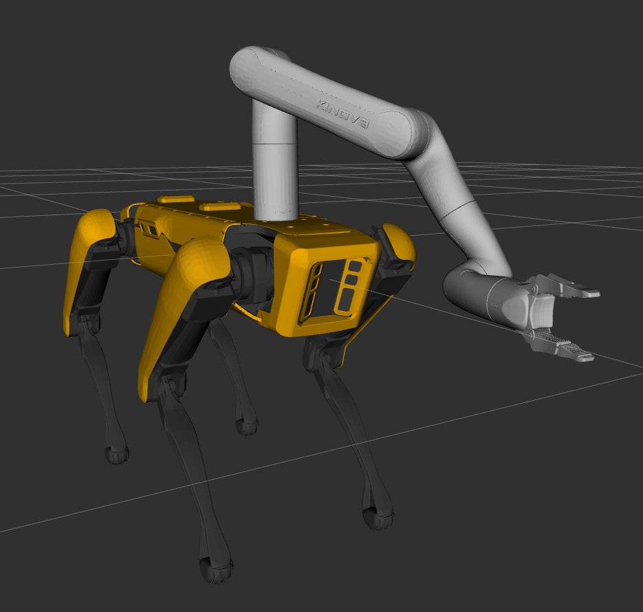

Mobile Manipulation with Spot
===============================

Spot features two rails along the dorsal surface that can be used for mounting a lightweight arm.  Boston Dynamics
produces the `Spot Arm <https://www.bostondynamics.com/spot-arm>`_, which is not currently supported by this ROS
package.

Currently the only arm supported by the ROS driver for Spot is the
`Kinova Gen3 Lite <https://www.kinovarobotics.com/en/products/gen3-lite-robot>`_.

Arm Installation
-----------------

.. note::

    We are still finalizing the recommended mechanical and electrical installation process for attaching the arm to
    the robot.  We will update this section with detailed instructions as soon as possible.

    The arm must be securely attached to Spot's dorsal surface.  The arm requires power and the MicroUSB cable must
    be connected between the ROS computer and the arm.

Network Preparation
---------------------

The Gen3 Lite arm does not support configuring a custom IP address; it always operates on `192.168.1.10` using
ethernet-over-USB via its MicroUSB port.

First, identify the network device that the arm presents itself as by powering-on the arm and connecting the USB cable
to the PC.  Run ``dmesg`` and check for output like the following:

.. code-block::

    [  136.344363] rndis_host 3-9:1.0 enp0s20u9: renamed from usb0

Add the new device to the ethernet bridge regex (if necessary) in ``/etc/network/interfaces``.  For example, you may
need to add ``usb.*`` to the regex:

.. code-block::

    bridge_ports  regex (en.*)|(eth.*)|(usb.*)

Then add a new interface to the brige by adding

.. code-block::

    # Dedicated interface for communicating with the Gen3 Lite arm
    auto br0:1
    allow-hotplug br0:1
    iface br0:1 inet static
        address 192.168.1.1
        netmask 255.255.255.0

to ``/etc/network/interfaces/``.  Ensure that the network is up, and verify you can ping the arm with
``ping 192.168.1.10``.

Driver Installation
--------------------

The Gen3 Lite arm uses the `ros_kortex <https://github.com/Kinovarobotics/ros_kortex>`_ driver to run the arm.  To
allow control of the arm using MoveIt we provide the
`spot_manipulation <https://github.com/clearpathrobotics/spot_manipulation>`_ as well.

``cd`` into your ``catkin_ws/src`` folder and run the following commands:

.. code-block:: bash

    git clone https://github.com/clearpathrobotics/spot_manipulation.git
    git clone https://github.com/Kinovarobotics/ros_kortex.git -b melodic-devel    # or -b noetic-devel, as-necessary
    rosdep install --from-paths . --ignore-src -r -y
    cd ..
    catkin_make
    # If you are using Melodic, you may need to make the workspace with
    # catkin_make --cmake-args -DCMAKE_BUILD_TYPE=Release -DPYTHON_EXECUTABLE=/usr/bin/python3 -DPYTHON_INCLUDE_DIR=/usr/include/python3.6m -DPYTHON_LIBRARY=/usr/lib/x86_64-linux-gnu/libpython3.6m.so

If you plan on using a remote PC to run ``rviz`` to monitor and/or control the robot, you will need to clone the git
repositories above into a workspace on your remote PC and build them there too; ``rviz`` requires local copies of the
description packages referenced by the URDF.

Driver Usage
-------------

After successfully building your workspace, you can add the arm to the robot's URDF by adding

.. code-block:: bash

    source /home/administrator/catkin_ws/devel/setup.bash
    export SPOT_URDF_EXTRAS=$(catkin_find spot_kinova_description urdf/spot_gen3_lite_description.urdf.xacro --first-only)

to ``/etc/ros/setup.bash``.  Restart ROS with ``sudo systemctl restart ros``.

Power-off the arm and physically move it so it is approximately straight; if the arm powers-on when any of the joints
are at highly-accute angles the arm can start outside the safe operating limits of the ``ros_kortex`` driver, preventing
the arm from moving at all.  Once the arm is in position, power it on and hold the arm steady until the LED turns green
and the motors engage, locking the arm in place.

Once the arm is fully powered-on and locked in place, start the arm driver with

.. code-block:: bash

    roslanch spot_kinova_bringup spot_gen3_lite_bringup.launch

This will start the driver for the arm and begin publishing the arm's joint states.  Running
``rostopic echo /joint_states`` should now show the positions and velocities for the arm joints, as well as the base
Spot platform's legs.

If you want to use MoveIt to control the arm, run

.. code-block:: bash

    roslaunch spot_gen3_lite_moveit_config spot_gen3_lite_moveit_planning_execution.launch

On your remote PC you can run

.. code-block:: bash

    roslaunch spot_viz view_robot.launch

and add the Motion Planning plugin to control the arm directly.
