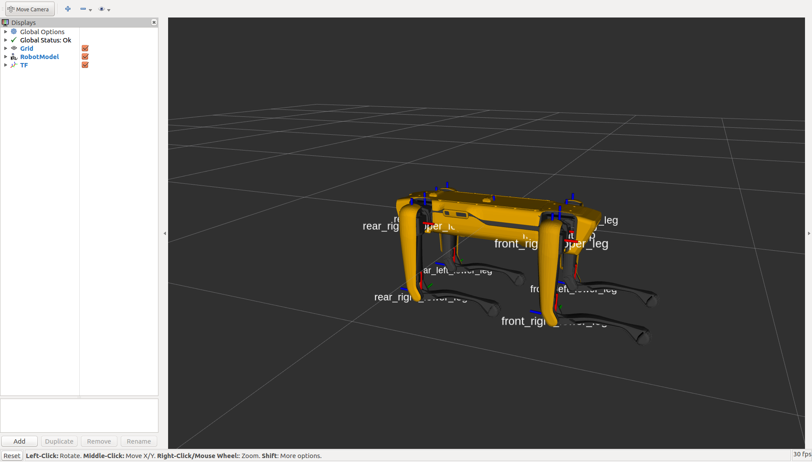
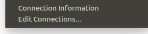
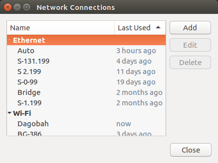
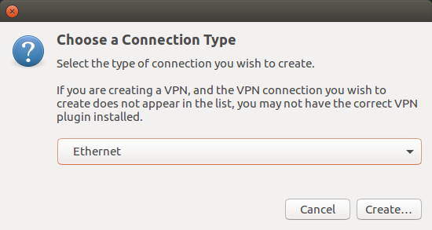
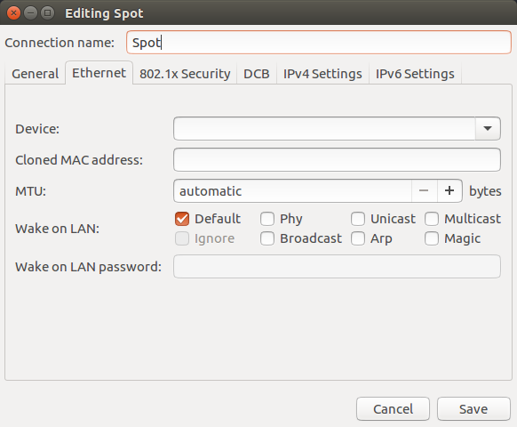
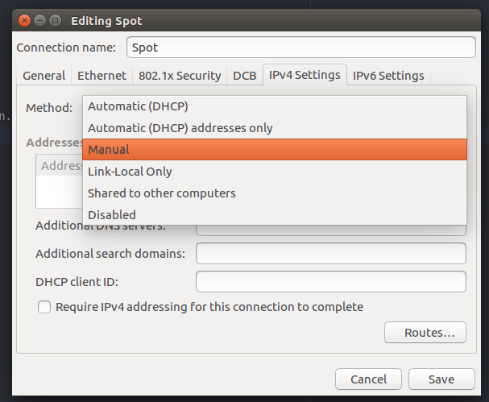
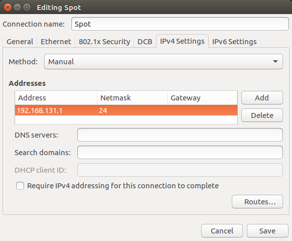
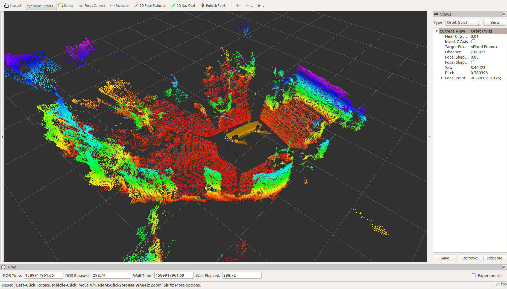

Spot ROS Driver Usuage
======================

Verify the URDF
---------------

To verify that the spot_viz and spot_description packages are sourced properly, you can run

.. code:: bash

  rosrun spot_viz view_model.launch

This will load RVIZ with the robot description visible.  It should also show any additions you may have added to the robot's URDF

Get an Applicaiton Token
------------------------

You will need to get an application token to have API access on the robot.  To get an application token, email support@bostondynamics.com with subject "Application Token Request."

Configure Your Networking
-------------------------

There are multiple ways that you can setup networking on your ROS computer.  This guide will cover two different common ways to do this

/etc/network/interfaces
~~~~~~~~~~~~~~~~~~~~~~~

The first way is by editing /etc/network/interfaces.  Below is a section that will create a bridge between all of your network ports and assign a static address of 192.168.131.1.  This is a common setup for Clearpath robots.  Ensure to put your ROS computer into the same subnet that you set for the Spot platform.

.. code:: bash

  auto br0

  iface br0 inet static
    bridge_ports regex (eth.*)|(en.*)
    address 192.168.131.1
    netmask 255.255.255.0
    bridge_maxwait 0

Network Manager
~~~~~~~~~~~~~~~

If you are using Ubuntu and it has a desktop environment, it will likely have Network Manager installed.  To create a new network connection, click the networking icon in the top right if your screen and choose Edit Connections.

You will see all of the other network connections you've setup in the past.  Click Add on the right to create a new network connection for the robot.

Select Ethernet as the connection type since we are connecting directly to the platform.

Give the connection a name.

Set the conneciton method to Manual.  This will give it a static address.

Under the IPV4 config, choose a static address for the ROS computer. Ensure to put your ROS computer into the same subnet that you set for the Spot platform.

Running the Driver
------------------

.. code:: bash

  roslaunch spot_driver driver.launch

When launching, there are some options you may need to configure for your setup.  They are:

+-----------+-------------------------------------------+-----------------------------------------------------+
| Argument  | Default                                   | Description                                         |
+===========+===========================================+=====================================================+
| username  | dummyusername                             | The username of the Spot user to authenticate using |
+-----------+-------------------------------------------+-----------------------------------------------------+
| password  | dummypassword                             | The password of the Spot user to authenticate using |
+-----------+-------------------------------------------+-----------------------------------------------------+
| app_token | /home/administrator/.bosdyn/dev.app_token | The file path to the Application Token from BD      |
+-----------+-------------------------------------------+-----------------------------------------------------+
| hostname  | 192.168.131.3                             | The IP address of the Spot robot                    |
+-----------+-------------------------------------------+-----------------------------------------------------+

View the Robot
--------------

Once the robot is connected, you should be able to visualize its odometry, joint positions, camera streams, etc. using RVIZ.  To view these streams, run

.. code:: bash

  roslaunch spot_viz view_robot.launch

Remember that you will need to source your workspace before running this command.

Once RVIZ is loaded, you should see something similar to this.

Taking Control of the Robot
---------------------------

To control Spot, you need to maintain control of the eStop and body lease, power on the drive motors, and command the robot to stand.

Body and eStop Control
~~~~~~~~~~~~~~~~~~~~~~

A body lease gives the holder the ability to command the spot to make actions in the world.  The eStop gives the robot a way to guarantee that the commanding system is maintaining contact with the robot.  There are two ways to claim a body lease and eStop using this driver.

#. Automatically when the driver starts by enabling the ``auto_claim`` variable
#. By calling the claim service after the driver is started

You cannot claim a lease on the robot if something else already has a lease.  This is for security reasons.  Check the ``status/leases`` topic for information on current leases.

Enable Motor Power
~~~~~~~~~~~~~~~~~~

Motor power needs to be enabled once you have a Lease on the body.  This can be done in two ways:

#. Automatically when the driver starts by enabling the ``auto_power_on`` variable
#. By calling the power_on service after the driver is started

Stand the Robot Up
~~~~~~~~~~~~~~~~~~

Once the motors are powered, stand the robot up so it is able to move through the world.  This can be done in two ways:

#. Automatically when the driver starts by enabling the ``auto_stand`` variable
#. By calling the stand service after the driver is started

Controling the Velocity
-----------------------

.. warning::

  Spot will attempt to avoid any obstacles it detects with its cameras, but no vision or actuation system is perfect.  Make sure to only move the robot in a safe area and in a controlled manner.

ROS Topics
~~~~~~~~~~

To control Spot, you can send a Twist ROS message to command a velocity.  To test this, open a new terminal and source your ROS installation.  Then, run this command in your terminal

.. code:: bash

  rostopic pub /spot/cmd_vel geometry_msgs/Twist "linear:
    x: 0.0
    y: 0.0
    z: 0.0
  angular:
    x: 0.0
    y: 0.0
    z: 0.3" -r 10

That command will have spot rotate on the spot at 0.3 radians/second.  Note the -r at the end of the command.  That has ROS resend the message over again.  If you don't resend the message, the driver will assume a timeout and stop commanding motion of the robot.

Interactive Marker
~~~~~~~~~~~~~~~~~~

Inside of RVIZ, grab the red arrow that is around Spot's body and pull it forward or backwards to have Spot walk.  If you rotate the blue circle around the body, Spot will turn on the spot.  This is a very simple, but inaccurate to move Spot

Controling the Body
-------------------

The angle of the body relative to the feet is also controllable through a ROS topic, but there is no interactive marker yet.

To control the body position through a terminal, send the following command:

.. code:: bash

  rostopic pub /spot/body_pose geometry_msgs/Pose "position:
    x: 0.0
    y: 0.0
    z: 0.0
  orientation:
    x: 0.0
    y: 0.0
    z: 0.0
    w: 1.0"

Note that the -r is not needed for this command.  This sets the position the body should be in until changed.

Monitoring the Platform
-----------------------

+------------------------+----------------------------+---------------------------------------------------------+
| Topic                  | Type                       | Description                                             |
+========================+============================+=========================================================+
| status/metrics         | Metrics                    | General metrics for the system like distance walked     |
+------------------------+----------------------------+---------------------------------------------------------+
| status/leases          | LeaseArray                 | A list of what leases are held on the system            |
+------------------------+----------------------------+---------------------------------------------------------+
| odometry/twist         | TwistWithCovarianceStamped | The estimated ofometry of the platform                  |
+------------------------+----------------------------+---------------------------------------------------------+
| status/feet            | FootStateArray             | The status and position of each foot                    |
+------------------------+----------------------------+---------------------------------------------------------+
| status/estop           | EStopStateArray            | The status of the eStop system                          |
+------------------------+----------------------------+---------------------------------------------------------+
| status/wifi            | WiFiState                  | Status of the wifi system                               |
+------------------------+----------------------------+---------------------------------------------------------+
| status/power_state     | PowerState                 | General power information                               |
+------------------------+----------------------------+---------------------------------------------------------+
| status/battery_states  | BatteryStateArray          | Information for the battery and all cells in the system |
+------------------------+----------------------------+---------------------------------------------------------+
| status/behavior_faults | BehaviorFaultState         | A listing of behavior faults in the system              |
+------------------------+----------------------------+---------------------------------------------------------+
| status/system_faults   | SystemFaultState           | A listing of system faults in the system                |
+------------------------+----------------------------+---------------------------------------------------------+
| status/feedback        | Feedback                   | Feedback from the Spot robot                            |
+------------------------+----------------------------+---------------------------------------------------------+

Troubleshooting
---------------

These instructions are a minimum subset of instructions to get this driver working and do not contain all necessary debugging steps.  Please refer to the `Spot SDK Quickstart <https://github.com/boston-dynamics/spot-sdk/blob/master/docs/python/quickstart.md>`_ for more detailed debugging steps.
